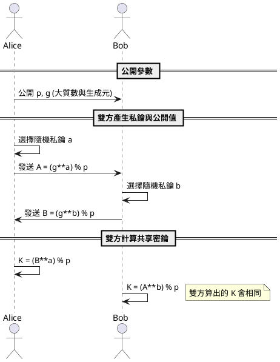

---
{"dg-publish":true,"permalink":"/技術文件/密碼學 - 零知識證明 - 密鑰協商/","tags":["技術研究","演算法"],"created":"2025-07-17T22:11:07.518+08:00","updated":"2025-12-17T23:01:05.815+08:00"}
---




# 範例程式(Diffie-Hellman 方法)
讓我們用密碼學最常用的人名 Bob 與 Alice 舉例

Bob 端
```python
import random
# Diffie-Hellman
p = 23 # 公開參數
g = 5 # 公開參數

bob_private = random.randint(1, p-1)
bob_public = (g ** bob_private) % p  # 2
print("Bob 的公開值：", bob_public)

alice_public = int(input("請輸入 Alice 的公開值: "))
bob_shared = (alice_public ** bob_private) % p
print("Bob 計算的共享密鑰：", bob_shared)
```

Alice 端
```python
import random
p = 23 # 公開參數
g = 5 # 公開參數

alice_private = random.randint(1, p-1)
alice_public = (g ** alice_private) % p  # 8
print("Alice 的公開值：", alice_public)

bob_public = int(input("請輸入 Bob 的公開值: "))
alice_shared = (bob_public ** alice_private) % p
print("Alice 計算的共享密鑰：", alice_shared)

```

只要輸入對方的公開數，就能計算出共享密鑰


# 重放攻擊
```python
# Eve 已知 g, p, alice_public
p = 23 # 公開參數
g = 5 # 公開參數
alice_public = 12

# Eve 嘗試所有可能的私鑰
for possible_private in range(1, p):
    if (g ** possible_private) % p == alice_public:
        print("Alice 的私鑰是：", possible_private)
        break
```
## 離散對數問題
在正常情況下，Eve（攻擊者）無法輕易算出 Alice 的私鑰，這正是 Diffie-Hellman 密鑰交換的安全基礎。
原因如下：
	Alice 的公開值是：alice_public = (g ** alice_private) % p
	Eve 想要知道 alice_private，必須解「離散對數問題」：已知 g、p、alice_public，求 alice_private
	這個問題在大質數下是非常困難的（目前沒有有效的演算法），所以只要 p 夠大，Alice 的私鑰就很安全
	但如果 p 很小（像教學範例 p=23），Eve 可以用暴力法：
	
	這種方法只適用於 p 很小的情況。
	實務上 p 至少要 2048 位元，這樣 Eve 幾乎不可能算出 Alice 的私鑰。
總結：
	p 小時，Eve 可以暴力破解 Alice 的私鑰
	p 夠大時，Eve 幾乎不可能算出 Alice 的私鑰
	這就是 Diffie-Hellman 的安全基礎

# 安全質數
選用夠大的「安全質數」可以防止離散對數被暴力攻擊
https://datatracker.ietf.org/doc/html/rfc3526#section-2